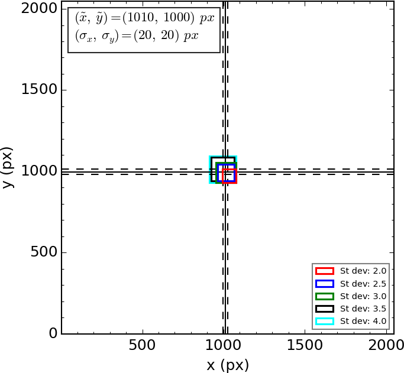

Center determination
====================

Determining the central coordinates of a SC with accuracy is of utmost
importance, since this parameter directly affects the generation of the radial
density profile, and thus also the estimation of the SC's radius.

**ASteCA** determines the center value in two steps: a coarse approximation
is done first and a Gaussian kernel density estimation (KDE) is then applied to
obtain precise final coordinates.

.. _approx-center:

Approximate center values
-------------------------

The positional data is first binned in a 2D histogram. The bin width is either
automatically calculated as 1% of the minimum range in either coordinate
(x, y), or set manually via the ``params_input.dat`` file in the **Structure
functions parameters** block, by setting the ``bin_width`` parameter (``CH``
ID line).

.. important::
  Unless there is a specific reason to use the ``manual`` mode to set the bin
  width, it is recommended to use the *1% range* ``auto`` value. This figure has
  proven to be a very good heuristic value in a large number of situations.

This 2D histogram is processed with a Gaussian filter to smooth it out, using
five different bandwidths of increasing values (see `get_center.py`_ function
for more details)

The maximum density values of each Gaussian filtered version of the 2D
histogram, are presented in the final output image as seen in
:numref:`fig-2dhisto`.

.. _fig-2dhisto:

   Approximate center coordinate values. The standard deviation
   values in the bottom right corner are the bandwidth values used in the
   Gaussian filter.
   The box in the top left corner contains the averaged coordinate values and
   their standard deviations (shown in the plot as continuous and dashed lines
   respectively).

Each one of these values represents an approximation to the final center
coordinates obtained in the next step (see section below).

If the ``semi_input.dat`` file is used to pass approximate center coordinates,
this analysis is skipped and only the passed value is presented in the plot.

Precise center value
--------------------

Once the approximate center coordinates have been obtained, **ASteCA** proceeds
to refine this result. To this end, the code employs the approximate center
coordinates obtained in the previous step using the smallest bandwidth value
(``St dev: 2.0`` in :numref:`fig-2dhisto`), or :math:`center_{bw-min}`.

These coordinates serve as initial values for the cluster's center. The final
*precise* values are determined as the maximum spatial density of a
two-dimensional Gaussian kernel, generated on a reduced square area of the
positional diagram of the cluster; see :numref:`fig-center-area`.

.. _fig-center-area:

.. figure:: _static/center-area-search.png
   :scale: 80 %
   :align: center

   In yellow, area where the center coordinates are searched via the
   KDE. Blue lines are contour curves, the center found is marked with a cross.

The square area where the final center coordinates are searched is centered on
the :math:`center_{bw-min}` values, with a side length that spans 50% of the
minimum x,y range.
The bandwidth of the fitted kernel is automatically defined via Scott's rule
(`Scott 1992`_). 

In :numref:`fig-center` we can see the final center coordinates (equivalently:
the maximum value of the positional KDE) plotted over the Gaussian filtered 2D
histogram obtained using the minimum bandwidth, as defined in Sect.
:ref:`approx-center`.

.. _fig-center:

.. figure:: _static/center.png
   :scale: 80 %
   :align: center

   Cluster's center found via the KDE analysis. The ``Bin`` value
   in the top right corner is the bin width of the 2D histogram mentioned
   in the previous section, used to obtain the approximate center coordinates.

After this analysis is completed, the final center coordinates are compared
with the approximate values obtained in the previous section. Two flags are
raised warning the user about large deviations that could require careful
revision, and stored in the output file ``asteca_output.dat``.

The flags must meet the following conditions in order to be raised:

* **f1**: The median value for the approximate center coordinates in either x or
  y, is more than 10% away from the final center coordinates.

* **f2**: The standard deviation for the approximate center coordinates in
  either x or y, is larger than 10% of the final center coordinates.

.. _get_center.py: https://github.com/asteca/asteca/blob/master/functions/structure/get_center.py
.. _Scott 1992: http://onlinelibrary.wiley.com/book/10.1002/9780470316849
